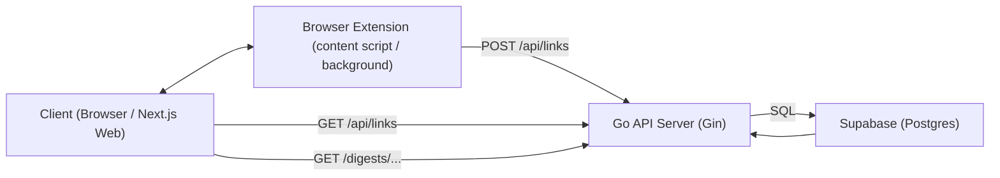
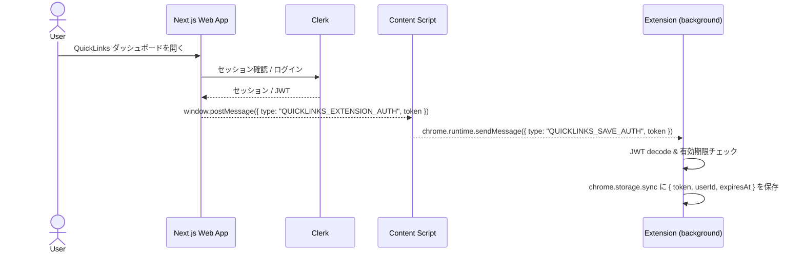
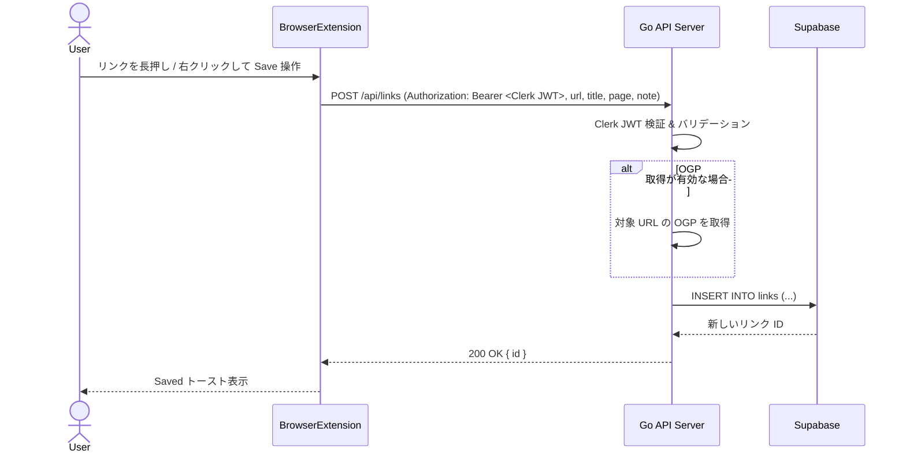
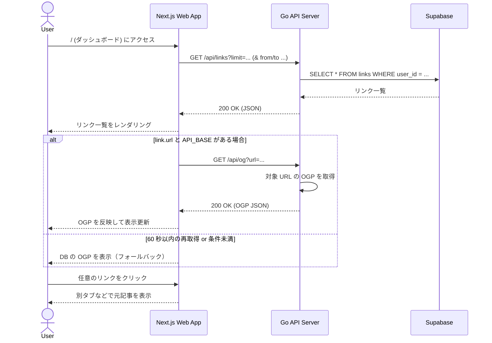
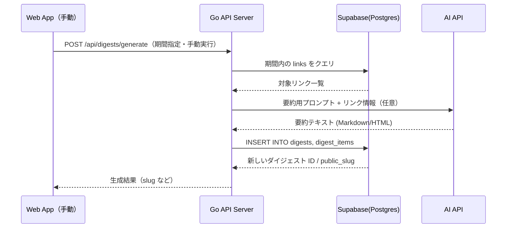

# アーキテクチャ概要

## 主要コンポーネント

| コンポーネント | ディレクトリ | 技術                |
| -------------- | ------------ | ------------------- |
| ブラウザ拡張   | /extension   | Chrome Manifest V3  |
| API サーバー   | /api         | Go + Gin            |
| Web アプリ     | /web         | Next.js             |
| データベース   |              | Supabase / Postgres |

## コンポーネント構成

### ブラウザ拡張（extension）

- スマホ：content script がページ上でリンクの「長押し」を検出し、小さな `Save` ボタンを表示。
- PC：リンクの右クリックメニューに「Save link to QuickLinks（仮）」などのコンテキストメニュー項目を追加。
- 上記いずれかの操作で以下のペイロードを API に送信：
  - `url`: 保存対象のリンク URL
  - `title`: リンクテキスト or ページタイトル
  - `page`: 保存操作をしたページの URL
  - `note`: 将来用に、選択テキスト等を載せられる余地
- 拡張はローカルに保存している Clerk の JWT を使って、`fetch("{API_BASE}/api/links")` に JSON を POST。
- HTTP ヘッダ `Authorization: Bearer <JWT>` を付与して認可を通す（共有シークレット方式は廃止）。
- Clerk JWT テンプレート: `quicklinks-extension`
  - カスタムクレームなし（`sub` を user_id として使用）
  - 有効期限: 7 日固定（仕様として継続運用）
  - 期限切れの場合は Web からの再同期で更新する
- Clerk の JWT は QuickLinks Web アプリへのログイン時に同期される。Web 側が `window.postMessage` でトークンをブラウザに投げ、拡張の content script → background がそれを受け取って `chrome.storage.sync` に保存する。
- 拡張側で独自のサインイン UI は持たず、Web ログイン済みであることを前提にトークン同期のみ行う。

### API サーバー（api, Go + Gin）

### Web アプリ（web, Next.js）

- 役割：
  - 保存されたリンクの一覧表示（ダッシュボード）。
  - 日付範囲 / ドメイン / タグなどによるフィルタ（段階的に追加）。
  - 将来的には、ダイジェストの閲覧や共有ページのレンダリングもここで担当（自動生成は最終版の範囲）。
- データ取得方法：
  - クライアント（useSWR）からは `/api/links` と `/api/og` を叩く。
  - **useSWR によるキャッシュ**: クライアントサイドでデータをキャッシュし、30 秒ごとに自動更新。
  - **OGP 情報の表示**: サムネイル画像、Description を表示（M3 で実装済み）。
    - 表示時に Go API の `/api/og` を呼び出してリアルタイムで OGP 情報を取得。
    - 各リンクカードが個別に OGP 情報を取得するため、非同期に読み込まれる。
    - 日付は DB の `saved_at` を表示（公開日/更新日概念は撤去）。
- ページ構成（最小）：
  - `/` … 最近保存されたリンクのリストページ。
    - 各リンクの `title` / `url` / `domain` / `og_image` / `description` / `saved_at` を表示。
    - クリックで元ページへ遷移。

### データベース（Supabase / Postgres）

- 本番：Supabase の Postgres（本番プロジェクト）を利用。
- ローカル
  基本的に同じ Supabase プロジェクトに対して開発用テーブル / データを使う想定（接続文字列は `.env` で管理）。
  必要に応じて、開発用 Supabase プロジェクトに切り替えられるようにしておく。

## コンポーネント図（クライアント ↔ 拡張 ↔ API ↔ DB）

## データフロー

### 1. 拡張と Web の認証同期フロー

- Clerk の「本当のログイン状態」は QuickLinks Web アプリ側が持ち、拡張はそれを後追いで同期する。
- ユーザーが Web ダッシュボードを開くと、Web は Clerk セッションから JWT を取得し、`window.postMessage` を通じて拡張に渡す。
- 拡張の content script がメッセージを受信し、`chrome.runtime.sendMessage` で background / 拡張本体に転送、JWT を `chrome.storage.sync` に保存する。
- 以降、拡張は `saveLink` などの API 呼び出し時に、この JWT を `Authorization: Bearer ...` として再利用する。

### 2. リンク保存フロー

- ユーザーが任意の Web ページでリンクを長押し。
- 拡張の content script がリンク要素を特定し、`Save` ボタンを表示。
- ユーザーが `Save` を押すと、拡張が `{ url, title, page, note?, tags? }` を含む JSON を `POST /api/links` に送信（`Authorization: Bearer <Clerk JWT>`）。
- API サーバーが JWT を検証し、DB にレコードを挿入。
- **保存時に OGP を取得できる場合は取得して DB に反映**（失敗時は空/既存値のまま）。
- 挿入結果の `id` を JSON で返し、拡張が「Saved」トーストを表示。

### 3. リンク取得（一覧）+ OGP 再取得（条件付き）フロー

- ユーザーが Next.js Web アプリ（例：`http://localhost:3000`）にアクセス。
- フロントエンドが初期ロード時に `GET {NEXT_PUBLIC_API_BASE}/api/links?limit=...` を叩き、最近のリンク一覧を取得。
- リンク一覧の **表示時** に、各リンクカードが **条件付きで** OGP を再取得する。
  - `link.url` と `NEXT_PUBLIC_API_BASE` があるときだけ `/api/og` を叩く。
  - クライアント側で **60 秒は重複取得を抑制**（同じ URL への再リクエストをスキップ）。
- 取得できた OGP は即座に UI に反映、失敗時は DB の `og_image` / `description` をフォールバックとして使う。
- **将来方針**: リンク取得時の OGP 再取得は廃止し、**保存時のみ OGP 取得**・取得時は **DB の情報のみ**を返す構成へ移行してパフォーマンスを改善する。

### 4. ダイジェスト生成フロー（将来拡張）

- **M5（手動）**: Web から手動で期間を指定してダイジェストを生成し、`digests` / `digest_items` に保存して一覧/公開ページで閲覧する。
  - AI 要約は手動トリガに含めてOK（失敗時はテンプレにフォールバック）

